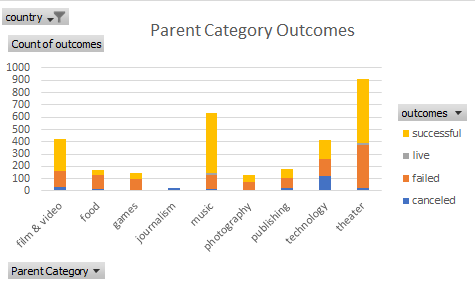
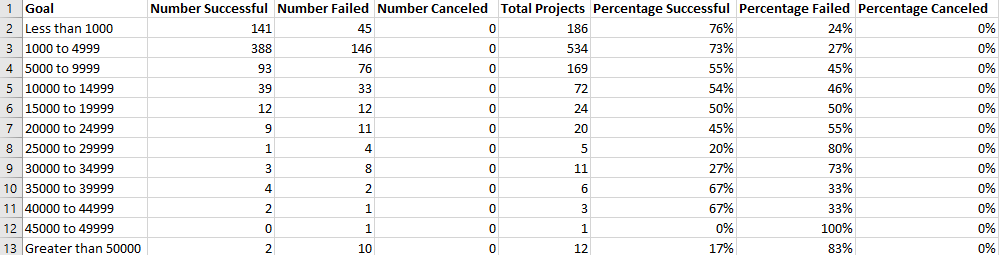
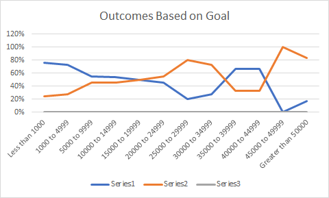
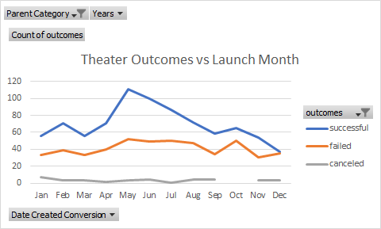

# An Analysis of Kickstarter Campaigns
Performing analysis on global kickstarter data to uncover trends of successful kickstarter projects across the globe. The purpose is to maximize the chances that Louise's play, Fear, will have a successful kickstarter campaign by quantifying categoristics of successful campaigns to be able to replicate certain characteristics of these campaigns while minimizing similarities towards failed campaigns.

## Analysis
The data collected for this project included the name of the campaign, a brief synopsis of said campaign, the goal amount to be reached versus the amount actually pledged (from this the outcome of the campaign could be derived, if it reached the goal amount the campaign could be said to be successful whereas if it fell short the campaign would have failed), the country of origin of he campaign as well as the category and subcategory and the launch date of the campaign. Certain challenges that arose during the analysis as a result of the data set were that the date stamps on the data sheet were coded as Unix timestamps. In order to perform succesful analysis on these dates a conversion had to be made using the formula =(((J2/60)/60)/24)+DATE(1970,1,1) wherein J2 represented the column of the unix timestamp.

---

To begin the analysis a graph was created in order to demonstrate how the high level categories of the different campaigns might affect their outcome

From this graph it can be derived that the two most popular kickstarter campaigns in the data set fell under the theater and music categories. These categories happened to be two of the more successfull categories as well. Of the 912 kickstarter campaigns in the US that could be categorized as theater 525 of them were successful thus boasting a %57.5 percent success rate and of the 636 musical campaigns launched 490 were successful thus sporting a great %77 percent success fate. When compared to the other categories it can be seen these categories seem to be more successful with only film and video sporting a higher success percentage than theater, although on a much smaller sample size.

---

Next, an analysis was done to see how the goal amount might play a role in the success or failure of the campaign. In order to best visualize this 12 buckets were created to map the maximum goal amounts for the kickstarter campaigns:

The columns were populated by counting the number of plays based upon the subcategory being theater,the goal amount falling into each corresponding bucket and if the result was marked as successful. From this data I was then able to gather this graph:

From this data it can be seen that for kickstarter theater campaigns started in the US, a successful outcome is much more like for campaigns with a smaller original goal. The percentage that the campaign will be successful drops corresponding to increases in goal amount.  While it can be seen from the chart that the percentage does increase again between the $30,000 to $40,000 bucket, the sample size for these are relatively small and as such I do not believe much can be infered from this.

---

Finally an analysis was done to see how the launch month of the campaign might affect the outcome for theater kickstarters in the US.

From this graph we can see how theater outcomes successes start to increase beginning around April before peaking between May and June before declining again reaching a low in December.

## Results

Giving these charts it can be seen that Louis's play, Fever, is not in a risky demographic with plays being the most popular form of kickstarter campaign of all the ones in the data set and also boasting one of the highest success rates.

That being said there are certain measures that Louise should enact in order to hopefully realize a successful campaign. As previously demonstrated the success of a campaign is directly tied towards the goal amount of the play with more expensive plays having a much higher chance of failure than cheaper plays. With this information in mind Louise should do everything possible to minimize the budget of the play so as to minimize the goal amount on kickstarter, preferably keeping the goal amount below $20,000, above which it can be seen that less than half of the campaigns started met  with success. Finally, the ultimate graph demonstrates how the Launch month of the campaign could play a huge role in the success or failure of the campaign. Kickstarter users seem much less likely to donate towards plays during winter months, likely due to the temperature and are much more likely to support play campaigns during the period of April and June although the success rate finds a peak around May. With this information in mind Louise should plan to start his campaign around these months in order to maximize his chances of success.

